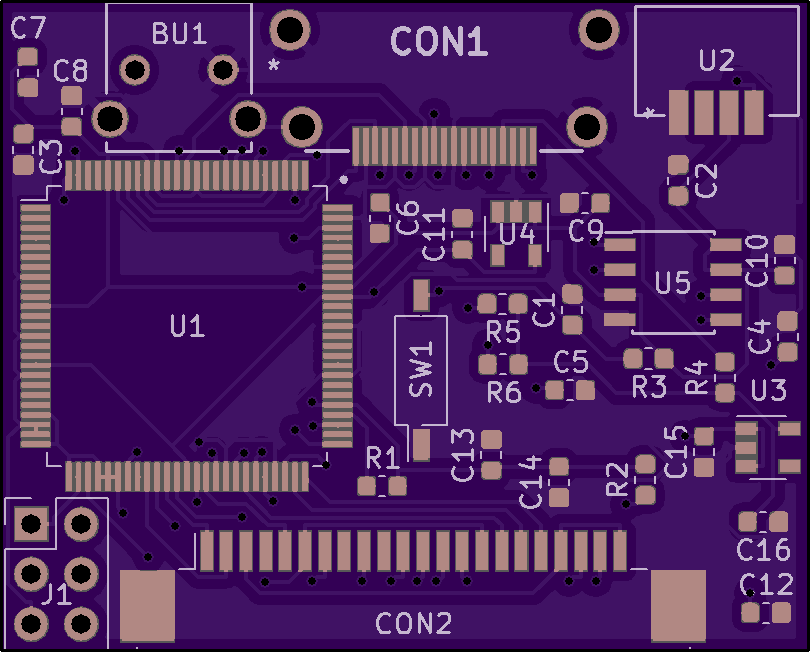
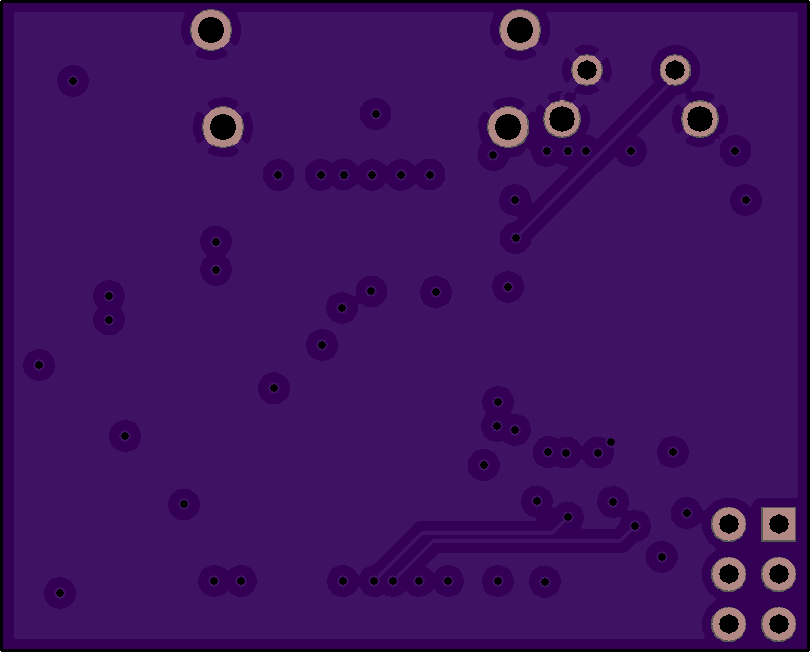

# Panasonic Q internal HDMI mod
Based on shematics provided by [HDMy Cube](https://twitter.com/HDMyCUBE) this would not be possible without their help, so go buy their adapters for the Gamecube.

This replaces the digital port on the Panasonic Q, and does not require any soldering on the console itself.

## Images

**BOM**

| Reference        | Part Number           | Description  |
| ------------- |:-------------:| -----:|
| BU1 | 1825027-5 | Push Button |
| C1 | LMK107AC6475MA-T | 4.7uF 0603 Capacitor |
| C2 | CS0603KRX7R9BB104 | 0.1uF 0603 Capacitor |
| C3 | CS0603KRX7R9BB104 | 0.1uF 0603 Capacitor |
| C4 | CS0603KRX7R9BB104 | 0.1uF 0603 Capacitor |
| C5 | CS0603KRX7R9BB104 | 0.1uF 0603 Capacitor |
| C6 | CS0603KRX7R9BB104 | 0.1uF 0603 Capacitor |
| C7 | CS0603KRX7R9BB104 | 0.1uF 0603 Capacitor |
| C8 | CS0603KRX7R9BB104 | 0.1uF 0603 Capacitor |
| C9 | NMC0603X5R106M10TRPF | 10uF 0603 Capacitor |
| C10 | CS0603KRX7R9BB104 | 0.1uF 0603 Capacitor |
| C11 | CC0603MRX5R7BB225 | 2.2uF 0603 Capacitor |
| C12 | CS0603KRX7R9BB104 | 0.1uF 0603 Capacitor |
| C13 | CS0603KRX7R9BB104 | 0.1uF 0603 Capacitor |
| C14 | CS0603KRX7R9BB104 | 0.1uF 0603 Capacitor |
| C15 | CS0603KRX7R9BB104 | 0.1uF 0603 Capacitor |
| C16 | CS0603KRX7R9BB104 | 0.1uF 0603 Capacitor |
| R1 | RC0603JR-13330RL | 330 Ohm 0603 Resistor |
| R2 | RMCF0603JT4K70 | 4.7K Ohm 0603 Resistor |
| R3 | RMCF0603JT4K70 | 4.7K Ohm 0603 Resistor |
| R4 | NRC06J103TRF | 10K Ohm 0603 Resistor |
| R5 | NRC06J103TRF | 10K Ohm 0603 Resistor |
| R6 | RK73B1JTTD181J | 180 Ohm 0603 Resistor |
| CON1 | 10029449-111RLF | HDMI Connector |
| CON2 | 2-84953-2 | FPC Connector |
| SW1 | CHS-01TB | Used for updating the firmware |
| U1 | XC3S200A-4VQG100C |  |
| U2 | TSOP36238TR | IR Remote Receiver |
| U3 | LP2980AIM5X-5.0/NOPB |  |
| U4 | TLV70212QDBVRQ1 |  |
| U5 | MX25L4006EM1I-12G |  |

Flashing
-------------------------

- To be added
